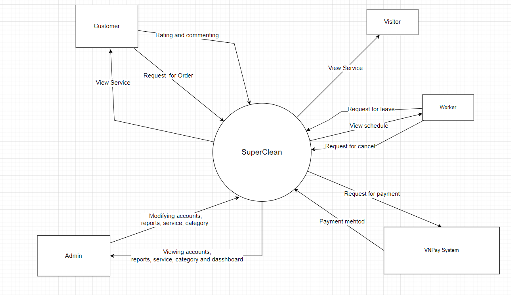
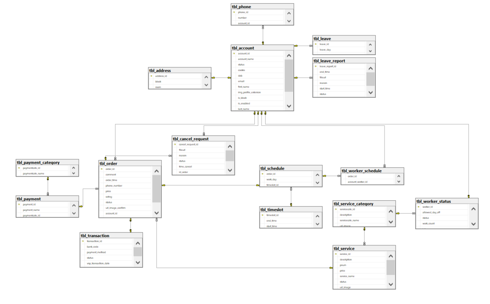
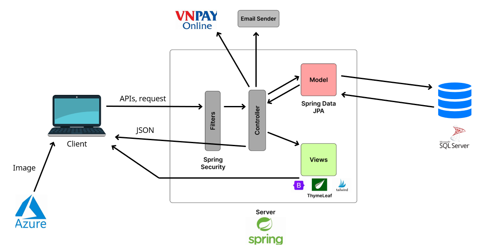

    SuperClean

# Introduction
### **1. Product Background**

In the current economic situation, we can see more and more young people have to leave home to live in the city. And one of their accommodation options is apartments, and one of the most popular types of apartments is Vinhomes. According to our survey, there are not many platforms that provide apartment cleaning services today and most of them also lack some functions of an ecommerce service platform such as saving order information, according to worker monitoring or service evaluation, which must be contacted via a hotline in order to book a service.

### **2. Proposed Solution**
Our team developed this app to provide a service booking platform for a cleaning company targeting Vinhomes residents that can be used to conveniently manage orders, workers and customers.

Context Diagram:

Use Case Diagram:

### **3. Database Implementation**
There is a HomeSDb.bak file for restoring the database for usage (only work in SQL Server 18 and above)
- Customer's password: abc123
- Worker's password: 123
- Admin's password: 123

Database diagram:

# System Architecture
### **1. Coding Environment**
Tools: IntelliJ IDEA, VSCode, Postman, NodeJs, Java18 - Maven, Microsoft SQL Server 18

### **2. System Architecture**

SuperClean follows MVC architecture with intergration of Restful Api for better page performance by not reloading the page
- Model is implemented by Spring Data JPA using code-first approach
- Views uses ThymeLeaf template engine, has a NodeJs environment set up for prototyping pages and components with TailWind before injecting template code inside
- Controller uses both @Controller and @RestController of Spring, uses Spring Security for filters (session and cookie) for authorization and authentication
- Databases is SQL Server, entities needed to have images are mapped into tables with a varchar fileUrl link to Azure blob to easily edit and manage images

# Team and lessons learned
### **1. Team**
- Huynh Anh Kiet (me - Leader) | Database, dashboard, worker assignment by order, worker schedule page, security
- Nguyen Do Cao Linh | Leave report, Order cancel request
- Tran Dinh Anh Minh | Set up VNPay, Mail sender, security
- Huynh Truong Minh Tri | Admin management pages
- Chu Minh Hai | Set up Azure, Admin management pages

There was no seperation of front-end and back-end responsibility, task was distributed by features. After half the progress, front-end was polished by Tri and me.

### **2. Lessons learned**
Knowledge:
- Usage of ORM framework
- Implementing Restful Api in back-end, and fron-end that consumes json from apis
- N-layer architecture
- Version Control
- Agile Programming
- Team coordination 

Limitation:
- Inefficient use of technologies: JPA (n+1 problem), Spring Security (poor url architecture leads to too many filters) 
- Lack of experience in Software Requirement and Testing leads to bugs and wrong validation
- Lack of experience in technologies at the beginning leads to inability to seperate task and responsibilty approriately (difficulties in Git)

